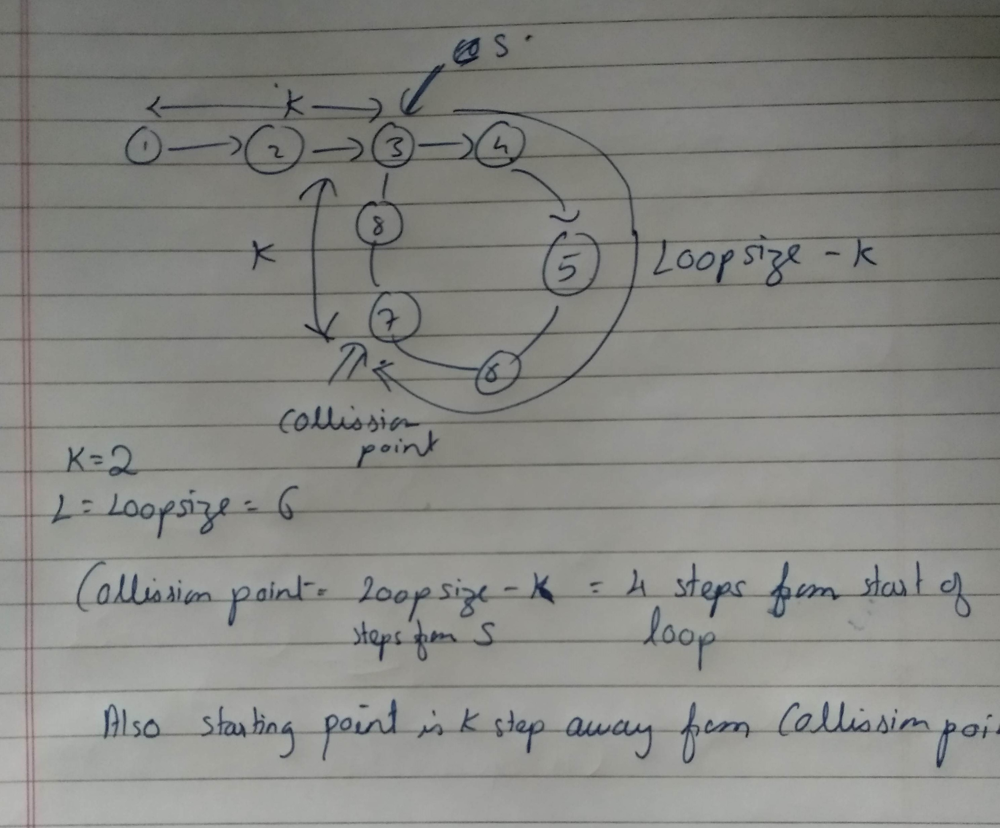

1. Create two pointers, FastPointer and SlowPointer. 
2. Move FastPointer at a rate of 2 steps and SlowPointer at a rate of 1 step. 
3. When they collide, move SlowPointer to LinkedListHead. Keep FastPointer where it is
4. Move SlowPointer and FastPointer at a rate of one step. Return the new collision point.

When SlowRunner enters the looped portion after k steps, FastRunner has taken 2k steps total and must be 2k - k steps, or k steps, into the looped portion. Since k might be much larger than the loop length, we should actually write this as mod ( k, LOOP _SIZE) steps, which we will denote as K.



```c++
#include<bits/stdc++.h>
using namespace std;

//C++ Code to Check Loop and Identify Starting Point in Loop
struct node
{
	int data;
	node *next;
};

class linkedlist
{
public:
	node *head;
	node *tail;
	linkedlist()
	{
		head=NULL;
		tail=NULL;
	}
	void add_node(int n);
};
void print_list(linkedlist &l)
{
	node *p = l.head;
	node *q = l.head;
	int count=0; //In case of Loop
	while(p!=NULL&&count<20)
	{
        cout<<p->data<<" ";	
		p=p->next;
		count++;
	}
}

void linkedlist::add_node(int n)
{
 	node *temp = new node;
 	temp->data = n;
 	temp->next = NULL;
 	if(head==NULL)
 	{
 		head=temp;
 		tail=temp;
 	}
 	else
 	{
 		tail->next=temp;
 		tail=tail->next;
 	}
}

void loop(linkedlist &l)
{
	node *slow = l.head;
	node *fast = l.head;
    // Move fast two steps in each iteration
	while(fast!=NULL&&fast->next!=NULL)
	{
		slow=slow->next;
		fast=fast->next->next;
		if(slow==fast) //Collision
			break;
	}
	if(fast==NULL||fast->next==NULL)
	{
		cout<<"No Loop"<<"\n";
		return ;
	}
	slow = l.head; //Move Slow to head
	while(slow!=fast)
	{
		slow=slow->next;
		fast=fast->next;
	}
	cout<<"Loop Point:"<<slow->data;
}

int main()
{

    ios_base::sync_with_stdio(false);
    cin.tie(NULL);
    linkedlist l;
    l.add_node(1);
    l.add_node(2);
    l.add_node(3);
    node *temp = l.tail;
    int i = 4;
    while(i<9)
    {
    	l.add_node(i);
    	i++;
    }
    l.tail->next = temp;
    print_list(l);
    loop(l);

    return 0;
}
```

```c++
1 2 3 4 5 6 7 8 3 4 5 6 7 8 3 4 5 6 7 8 Loop Point:3[Finished in 1.1s]
```

